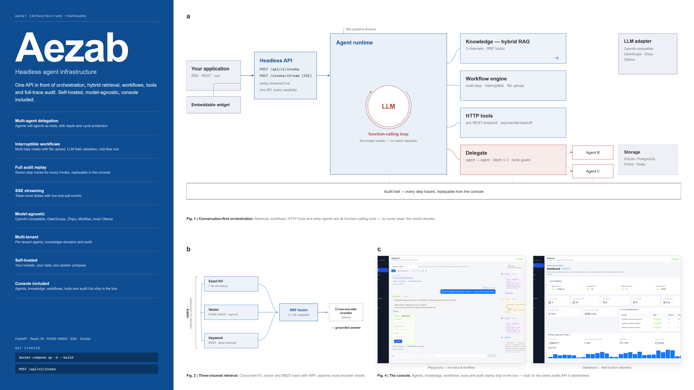

<div align="center">

# Aezab

自部署的 Agent 基础设施框架 —— 一个 API 背后是编排、混合检索、工作流、工具与全链路审计。

[English](README_en.md) | **中文**


</div>



## 为什么选择 Aezab

Aezab 适合需要把 Agent 接入现有业务系统的团队：控制台负责配置和测试，API 负责与你自己的 App、CRM、客服系统、内部后台或自动化流程集成。它是通用的 Agent 基础设施，而不是一款客服软件——同一套编排能力可以配置成智能客服、工单处理或内部助手。当前覆盖 Agent 管理、RAG 检索、工作流引擎、工具调用、ASR、Integrations、Playground 和调用审计，仍在持续迭代。

## 功能概览

| 模块 | 能力 |
| --- | --- |
| Agent Management | 多 Agent 管理、模型选择、能力绑定、Agent 协作。 |
| Knowledge / RAG | TXT、PDF、DOCX、XLSX、CSV 上传；BM25、向量检索、RRF 融合、可选 reranker。 |
| Workflow Engine | 顺序步骤、字段收集、文件上传、LLM 校验、失败处理、完成回调。 |
| Tool Calling | HTTP 工具注册、参数 schema、认证配置、超时、重试、连通性测试。 |
| Voice / ASR | 浏览器录音、音频上传、DashScope/OpenAI-compatible ASR、自部署 FunASR HTTP。 |
| Playground | 对话测试、RAG 命中、工具调用、工作流触发、错误和耗时追踪。 |
| Audit Trace | 每次调用生成 trace id，记录检索、模型、工具、工作流等执行事件。 |
| Headless API | `/invoke`、`/invoke/stream`、`/asr/transcribe` 等接口用于外部系统集成。 |

## 快速开始

环境要求：Docker 24+ 和 Docker Compose v2（唯一硬性要求）；源码运行后端需要 Python 3.10+；前端开发或手动构建需要 Node.js 18+。

```bash
git clone https://github.com/AbysenAI/aezab.git
cd aezab
cp .env.example .env
docker compose up -d --build
```

打开 `http://localhost:8000`，控制台会先引导你创建管理员账号并登录；如果还没有任何模型配置和 Agent，会自动弹出三步首次运行向导——选大模型供应商卡片（通义千问 / 智谱 / MiniMax / OpenAI / 本地 Ollama / 自定义，只需填 API Key）→ 测试连接 → 从模板一键创建 Agent → 跳转 Playground 直接测试对话。

需要完全离线的本地模型？改用 `docker compose --profile local-llm up -d`，会额外启动 Ollama 并在首次启动时自动下载一个约 1GB 的本地小模型（`qwen2.5:1.5b`）。

遇到问题看 [`docs/troubleshooting.md`](docs/troubleshooting.md)。

## 集成方式

所有 API 调用都通过 `X-API-Key` 请求头认证，Key 从控制台 **Integrations** 页面创建（勾选 `invoke` 作用域即可）：

```bash
curl -X POST http://localhost:8000/api/v1/invoke \
  -H "Content-Type: application/json" \
  -H "X-API-Key: <你的Key>" \
  -d '{"agent_id": "agent-id", "message": "我要报修厨房漏水", "tenant_id": "default"}'
```

流式调用把路径换成 `/api/v1/invoke/stream`（SSE，加 `curl -N` 保留流式输出）。最快的免代码接入方式是嵌入式聊天 Widget：把一段 `<script>` 标签贴进你的网页即可获得一个悬浮聊天气泡，完整可运行示例见 `examples/widget-demo.html`。

Integrations 页面同时提供 ASR 语音转写、Outbound Tools（Agent 调用你的业务 API）、Workflow Webhooks（工作流完成或关键步骤完成后回调，带 HMAC 签名）、以及 Trace & Debug 面板，供开发联调使用。

完整交互式文档见 `http://localhost:8000/docs`（Swagger UI）；SDK、Webhook 签名验证、限流/重试语义等细节见 [`docs/integration.md`](docs/integration.md)。

## 使用场景

- 智能客服：基于产品文档、服务政策、售后手册回答问题。
- 工单处理：报修、申请、审批、表单收集、订单查询、CRM 更新。
- 内部助手：制度问答、流程办理、系统查询、跨部门任务分发。
- 行业方案：在客户环境中部署，接入客户自己的模型、数据和业务 API。

## 架构

```text
aezab/
  server/            # FastAPI backend: api/ engine/ models/ schemas/ config.py
  console/src/       # React console: pages/ api.ts i18n/
  static/            # Built console assets + widget.js
  Dockerfile
  docker-compose.yml
  pyproject.toml
```

Aezab 使用 conversation-first runtime：Agent 绑定的能力（知识库、工作流、工具、Agent 协作）会转换为 function definitions，由模型根据对话上下文自行判断是否调用，没有单独的意图路由/分类层。触发逻辑和调优建议见 [`docs/configuration.md`](docs/configuration.md)。

## 源码运行

后端：

```bash
python -m venv venv
source venv/bin/activate          # Windows: venv\Scripts\activate
pip install -e ".[rag]"

cp .env.example .env
python -m uvicorn server.main:app --host 0.0.0.0 --port 8000
```

首次打开控制台同样会引导创建管理员账号并弹出首次运行向导；数据库和向量索引每 24 小时自动备份到 `./data/backups/`，源码运行和 Docker 部署共用同一套逻辑。

前端构建：

```bash
cd console
npm install
npm run build
cp -r dist/. ../static/
```

同步产物到 `static/` 时务必用合并式拷贝（如上），不要先清空目标目录——`static/widget.js` 是独立维护的嵌入脚本，必须在控制台构建后继续保留，细节见 [`docs/development.md`](docs/development.md)。

前端开发：

```bash
cd console
npm install
npm run dev
```

## 部署与运维

- SQLite 适合开发和小规模试用；生产推荐 PostgreSQL、Redis、HTTPS、反向代理和备份策略。
- API Key 和模型密钥应放在环境变量或部署平台的密钥管理系统中。
- 数据库和向量索引每 24 小时自动备份到 `./data/backups/`，服务启动时基于 Alembic 自动完成数据库结构迁移，无需运维手工 `ALTER TABLE`。

完整生产部署清单（单进程架构限制、SSE 反向代理配置、Widget 安全等）见 [`docs/deployment.md`](docs/deployment.md)。

## 文档索引

- [`docs/configuration.md`](docs/configuration.md) —— 模型、Agent、能力触发、知识库上传配置指南。
- [`docs/troubleshooting.md`](docs/troubleshooting.md) —— 常见问题自查。
- [`docs/deployment.md`](docs/deployment.md) —— 生产部署清单。
- [`docs/integration.md`](docs/integration.md) —— SDK / API / Webhook / Widget 集成细节。
- [`docs/migrations.md`](docs/migrations.md) —— 数据库迁移（Alembic）。
- [`docs/development.md`](docs/development.md) —— 开发规范与本地检查（面向贡献者）。

## License

MIT
