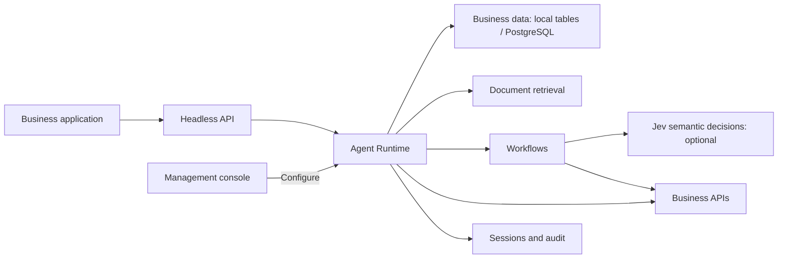

<div align="center">

# Aezab

Self-hosted task agents for support and internal operations — configure in the console, embed through one API, inspect every run.

**English** | [中文](README_zh.md)


</div>

## Why Aezab

Aezab handles support and internal operations, including order lookups, repair request collection and ticket routing. Workflow steps can require user confirmation before calling a business API. Deploy it in your own environment, manage agents and their models, business data and workflows from the console, and integrate with a support desk, CRM, employee portal or your own product through the API.

Order status, inventory and customer records are queried as structured data; policies and manuals are retrieved from documents. Business data sources support typed local tables, CSV imports and configured PostgreSQL tables or views. Query filters supplied by the model are validated; arbitrary SQL is not accepted. Platform storage defaults to SQLite and can be configured independently to use PostgreSQL. See [business data and database setup](docs/business-data.md).

## Jev and semantic routing

I find Jev's capabilities as a semantic router compelling. Choosing which queue should receive a support request, or which branch a workflow should take, is part of getting an agent to do useful work. Jev can use the supplied context to choose among explicit options and return probabilities that a program can act on. I believe in this direction, and it prompted this round of updates and adaptations to Aezab.

The engineering shift I care about is making semantic judgment an explicit step in a workflow. The conversation model handles understanding and dialogue; Jev handles a routing decision that needs semantic judgment; code determines what happens next. A developer can inspect the selected inputs, the outcome, and the conditions that led to clarification or a pause. Business code still owns validation and permissions, and external actions go through the existing execution path.

Aezab integrates TypeSafe's [System One Choice API](https://docs.typesafe.ai/api) through an optional **Jev decision node**, with connection editing and decision configuration in the workflow graph. You can specify inputs and choices, set confidence and selected-option probability thresholds, and connect the result to a workflow branch. No match, low confidence and service failures have explicit destinations. The execution trace retains the actual model version and probability distribution.

The integration is disabled by default. When enabled, only the node's selected input fields go to TypeSafe's cloud API. The current live checks verify the integration path; routing quality for your business still needs evaluation on your own requests. See the [setup guide and executable example](docs/jev-decisions.md) and [verification record](docs/verification-2026-09.md).

## Features

| Area | Capabilities |
| --- | --- |
| Agent Management | Multiple agents, model selection, capability binding, agent delegation. |
| Business Data | Typed records, atomic CSV/JSON import, parameterized PostgreSQL queries, required filters, row limits, tenant-scoped managed tools. |
| Knowledge / RAG | TXT, PDF, DOCX, XLSX, CSV upload; BM25, vector search, RRF fusion, optional reranking. |
| Workflow Engine | Executable graph, editable conditional/default/failure connections, field collection, confirmation, manual pause, completion callbacks. |
| Semantic Decisions | Optional Jev Choice nodes with selected input fields, two uncertainty thresholds, explicit fallback and decision traces. |
| Context Management | Bounded rolling summaries retained before old chat, unsummarized history, input/tool budgets, atomic tool messages and bounded delegation. |
| Tool Calling | HTTP tool registration, parameter schema, auth config, timeout, retry, connectivity test. |
| Voice / ASR | Browser recording, audio upload, DashScope/OpenAI-compatible ASR, self-hosted FunASR HTTP. |
| Playground | Conversation testing, RAG hits, tool calls, workflow triggers, latency, and errors. |
| Session Operations | Latest message history with older-page navigation; restore a saved session and its actual workflow card, then explicitly continue. |
| Audit Trace | Trace id for each run, with retrieval, model, tool, and workflow events. |
| Headless API | `/invoke`, `/invoke/stream`, `/asr/transcribe`, and related APIs for external integration. |

## Quick Start

Requirements: Docker 24+ and Docker Compose v2 (the only hard requirement); Python 3.10+ if you run the backend from source; Node.js 20+ for frontend development or manual builds.

```bash
git clone https://github.com/Greebbie/Aezab.git aezab
cd aezab
cp .env.example .env
docker compose up -d --build
```

Open `http://localhost:8000`, create an admin account and sign in. The first-run wizard helps you connect and test a model, create an agent from a template, and open it in Playground. Presets cover Qwen, Zhipu, MiniMax, OpenAI and local Ollama. A custom service needs its address, model name and any required API key.

For a local model, run `docker compose --profile local-llm up -d`. This starts Ollama and downloads the approximately 1GB `qwen2.5:1.5b` model on first boot. The initial download requires internet access; inference then runs locally.

Hit a snag? See [`docs/troubleshooting_en.md`](docs/troubleshooting_en.md).

## Integrate

Authenticate agent invocations with an `X-API-Key` header. Create a key from the console's **Integrations** page with the `invoke` scope:

```bash
curl -X POST http://localhost:8000/api/v1/invoke \
  -H "Content-Type: application/json" \
  -H "X-API-Key: <your-key>" \
  -d '{"agent_id": "agent-id", "message": "I need to report a leaking kitchen pipe."}'
```

For streaming, swap the path for `/api/v1/invoke/stream` (SSE; add `curl -N` to keep the stream open). The fastest no-code integration is the embeddable chat widget: drop a `<script>` tag into your page to get a floating chat bubble — a full runnable example is in `examples/widget-demo.html`.

The Integrations page also covers ASR transcription, Outbound Tools (agents calling your own backend APIs), Workflow Webhooks (HMAC-signed callbacks when a workflow completes or reaches a key step), and a Trace & Debug panel for developer troubleshooting.

The full interactive API reference is at `http://localhost:8000/docs` (Swagger UI); SDKs, webhook signature verification, and rate-limit/retry semantics are in [`docs/integration.md`](docs/integration.md).

## Use Cases

- Customer support: answer from product docs, service policies, and support manuals.
- Ticketing: repairs, applications, approvals, form collection, order lookup, and CRM updates.
- Internal operations: policy Q&A, process execution, system lookup, and cross-team routing.
- Industry deployments: run in a customer environment with their own models, data, and business APIs.

## Architecture


```mermaid
flowchart LR
    app[Business application] --> api[Headless API]
    api --> agent[Agent Runtime]
    console[Management console] -->|Configure| agent
    agent --> data[Business data: local tables / PostgreSQL]
    agent --> knowledge[Document retrieval]
    agent --> workflow[Workflows]
    agent --> tools[Business APIs]
    workflow --> jev[Jev semantic decisions: optional]
    workflow --> tools
    agent --> history[Sessions and audit]
```

```text
aezab/
  server/            # FastAPI backend: api/ engine/ models/ schemas/ config.py
  console/src/       # React console: pages/ api.ts i18n/
  static/            # Built console assets + widget.js
  Dockerfile
  docker-compose.yml
  pyproject.toml
```

Aezab uses a conversation-first runtime: an agent's bound capabilities (knowledge, workflows, tools, agent delegation) become function definitions, and the conversation model chooses which to call. Once a workflow is active, saved graph transitions control execution; optional Jev nodes make specific semantic judgments within that graph. There is no mandatory classifier in front of every conversation. Triggering behavior and tuning notes live in [`docs/configuration_en.md`](docs/configuration_en.md).

## Run From Source

Backend:

```bash
python -m venv venv
source venv/bin/activate          # Windows: venv\Scripts\activate
pip install -e ".[rag]"

cp .env.example .env
cd console && npm ci && npm run build && cd ..
python -m uvicorn server.main:app --host 0.0.0.0 --port 8000
```

The first time you open the console it also walks you through creating an admin account and shows the first-run setup wizard. SQLite snapshots, the vector index and local files are backed up automatically every 24 hours to `./data/backups/`. PostgreSQL deployments need a separate database backup policy.

Build the frontend:

```bash
cd console
npm install
npm run build
```

Source deployments serve the build from `console/dist/`; Docker images use the packaged `static/` directory. Keep the separately maintained `static/widget.js` in place. See [`docs/development.md`](docs/development.md).

Frontend development:

```bash
cd console
npm install
npm run dev
```

## Deployment

- The default Compose deployment runs one application service with SQLite. Use HTTPS, a reverse proxy and tested backups for a public deployment; choose PostgreSQL when your storage requirements warrant it. Redis is not required or used by the current runtime.
- API keys and model credentials should be stored in environment variables or a deployment secret manager.
- SQLite snapshots, vector indexes and local files are backed up every 24 hours to `./data/backups/`; PostgreSQL needs a separate database backup. Schema migrations run automatically at startup via Alembic.

The full production deployment checklist (single-process architecture constraints, SSE reverse-proxy config, widget security) is in [`docs/deployment.md`](docs/deployment.md).

## Example: set up a knowledge-base support bot

Quick Start above just gets the service running; here's the full path from zero to wired into your business, using a "knowledge-base support bot" as the example.

1. **Clone and start**:

   ```bash
   git clone https://github.com/Greebbie/Aezab.git aezab
   cd aezab
   cp .env.example .env
   docker compose up -d --build
   ```

   By default this only starts `server`, with no model download. Open the console and the first-run wizard walks you through connecting a cloud model. Check readiness with `curl http://localhost:8000/health`.

   To use a local model, run:

   ```bash
   docker compose --profile local-llm up -d
   ```

   This additionally starts `ollama`. On first boot, `ollama-init` downloads the approximately 1GB `qwen2.5:1.5b` model. The initial download requires internet access; inference then runs locally.

2. **Open the console and follow the wizard**: visit `http://localhost:8000`, create an admin account and sign in. In the first-run wizard, select a provider and enter its connection settings, test the connection, then create an agent from a template. Presets cover Qwen, Zhipu, MiniMax, OpenAI and local Ollama. A custom service needs its address, model name and any required API key. Choose "Knowledge Support" here, then open Playground.

3. **Upload and bind knowledge**: open **Knowledge**, create a source and upload your FAQ or product docs (TXT / MD / PDF / DOCX / CSV / XLSX supported — see the "Knowledge Upload Standard" section in [`docs/configuration_en.md`](docs/configuration_en.md)). Under **Agents → Edit → Capabilities → Knowledge**, select that source and save. Ask a question in Playground to check retrieval and citations.

4. **Wire it into your site or your backend**: open **Integrations**, create an API key scoped to `invoke` only, then pick either path (or both):

   - **Web widget**: copy a `<script>` snippet into your website — it renders a floating chat bubble. A full runnable example is in `examples/widget-demo.html`.
   - **API integration (the primary path)**: call the Headless API straight from your own product's backend to embed the agent into an app, CRM, support desk, or any business process:

     ```bash
     curl -X POST "http://localhost:8000/api/v1/invoke" \
       -H "X-API-Key: <your-key>" -H "Content-Type: application/json" \
       -d '{"agent_id": "<agent_id>", "message": "Hello"}'
     ```

   SSE streaming, the Python/JS SDKs, file upload, and retry semantics are all covered in [`docs/integration.md`](docs/integration.md) (widget attribute reference in section 9).

Repair and booking templates initially save request details in the conversation. After connecting a business API, configure completion messages to match its actual receipt. For branching, try [support triage with Jev](docs/jev-decisions.md). A `human_review` node is currently a requester-resumable pause, not an authenticated staff approval queue. External systems must still enforce their own write permissions.

## Documentation

- [`docs/agent-engineering-2026-09.md`](docs/agent-engineering-2026-09.md) — architecture decisions, technical references and operating limits.
- [`docs/jev-decisions.md`](docs/jev-decisions.md) — Jev configuration, graph editing, uncertainty handling and verification.
- [`docs/business-data.md`](docs/business-data.md) — typed records, constrained business queries and platform PostgreSQL setup.
- [Contributing](CONTRIBUTING.md) · [Security](SECURITY.md)

- [`docs/configuration_en.md`](docs/configuration_en.md) — model, agent, capability-triggering, and knowledge-upload configuration guide.
- [`docs/troubleshooting_en.md`](docs/troubleshooting_en.md) — common issues.
- [`docs/deployment.md`](docs/deployment.md) — production deployment checklist.
- [`docs/integration.md`](docs/integration.md) — SDK / API / webhook / widget integration details.
- [`docs/migrations.md`](docs/migrations.md) — database migrations (Alembic).
- [`docs/development.md`](docs/development.md) — dev conventions and local checks (for contributors; Chinese only).

## License

[MIT](LICENSE)
