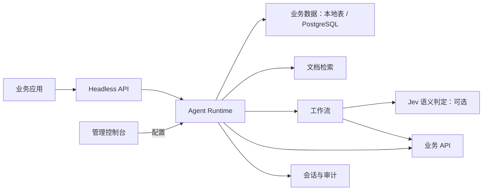

<div align="center">

# Aezab

自部署的任务 Agent 管理平台：在控制台配置客服与内部助理，通过 API 接入业务，逐次检查执行结果。

[English](README.md) | **中文**


</div>

## 为什么选择 Aezab

Aezab 用于客服与内部运营，支持订单查询、报修需求收集和工单分流，可为工作流中的业务接口调用配置用户确认。平台部署在自己的环境中，通过控制台管理 Agent 及其模型、业务数据和工作流，通过 API 接入客服系统、CRM、员工门户或自己的产品。

订单状态、库存和客户记录通过结构化数据查询，政策说明与操作手册通过文档检索获取。业务数据支持本地数据表和 CSV 导入，也可以连接指定的 PostgreSQL 表或视图。模型提供的查询条件经过校验，不能提交任意 SQL。平台数据默认保存在 SQLite 中，也可独立配置 PostgreSQL。详见 [业务数据与数据库配置](docs/business-data.md)。

## Jev 与语义路由

Jev 作为语义 router 展现出的能力很吸引我。客服请求该交给哪个队列，工作流接下来该走哪条分支，这些都是 Agent 真正处理事情时会遇到的问题。Jev 可以根据给定的上下文，从明确的候选项里作出判断，并返回概率供程序使用。我很认可这个方向，也因此为 Aezab 做了这一轮更新和适配。

我看重的工程变化，是让语义判断成为工作流里明确的一步。对话模型负责理解和交流，Jev 处理其中需要语义判断的分流，程序再按规则决定下一步怎么执行。开发者可以逐次检查模型看了哪些输入、选了什么，以及为什么进入补充信息或暂停处理的路径。校验和权限仍由业务代码负责，外部操作也要经过原有的执行流程。

Aezab 通过 TypeSafe 的 [System One Choice API](https://docs.typesafe.ai/api) 提供可选的 **Jev 判定节点**，支持在流程图中编辑连接和判定配置。你可以指定输入字段与候选项，设置置信度和选中项概率的阈值，再把结果接到具体分支。无匹配、低置信度或服务失败都有明确的去向；实际模型版本与概率分布会留在执行记录中。

Jev 接入默认关闭，启用后只有节点指定的输入字段会发往 TypeSafe 云端。当前的真实调用验证了接入链路，业务中的路由效果还需要用自己的请求样本评测。具体见 [配置说明与可运行示例](docs/jev-decisions.md) 和 [验证记录](docs/verification-2026-09.md)。

## 功能概览

| 模块 | 能力 |
| --- | --- |
| Agent Management | 多 Agent 管理、模型选择、能力绑定、Agent 协作。 |
| Business Data | 有类型的业务记录、原子 CSV/JSON 导入、PostgreSQL 参数化查询、必填条件、行数限制、租户隔离的查询工具。 |
| Knowledge / RAG | TXT、PDF、DOCX、XLSX、CSV 上传；BM25、向量检索、RRF 融合、可选 reranker。 |
| Workflow Engine | 可执行图形编排，条件、默认与失败连接，字段收集、请求人确认、人工暂停、完成回调。 |
| Semantic Decisions | 可选 Jev Choice 节点，指定输入字段、双阈值、明确失败去向和决策记录。 |
| Context Management | 有界滚动摘要优先于旧聊天保留、尚未摘要的历史、输入和工具预算、完整工具消息组、有界 Agent 委派。 |
| Tool Calling | HTTP 工具注册、参数 schema、认证配置、超时、重试、连通性测试。 |
| Voice / ASR | 浏览器录音、音频上传、DashScope/OpenAI-compatible ASR、自部署 FunASR HTTP。 |
| Playground | 对话测试、RAG 命中、工具调用、工作流触发、错误和耗时追踪。 |
| Session Operations | 默认查看最新消息，向前翻页；恢复已保存会话和真实工作流卡片，由用户明确继续执行。 |
| Audit Trace | 每次调用生成 trace id，记录检索、模型、工具、工作流等执行事件。 |
| Headless API | `/invoke`、`/invoke/stream`、`/asr/transcribe` 等接口用于外部系统集成。 |

## 快速开始

环境要求：Docker 24+ 和 Docker Compose v2（唯一硬性要求）；源码运行后端需要 Python 3.10+；前端开发或手动构建需要 Node.js 20+。

```bash
git clone https://github.com/Greebbie/Aezab.git aezab
cd aezab
cp .env.example .env
docker compose up -d --build
```

打开 `http://localhost:8000`，创建管理员账号并登录。首次运行向导会引导你选择供应商、填写连接信息并测试，从模板创建 Agent，然后进入 Playground。预设包含通义千问、智谱、MiniMax、OpenAI 和本地 Ollama；自定义服务需要填写地址与模型名，以及服务要求的 API Key。

使用本地模型时，运行 `docker compose --profile local-llm up -d`。该配置额外启动 Ollama，首次启动需要联网下载约 1GB 的 `qwen2.5:1.5b`；下载完成后可在本地运行。

遇到问题看 [`docs/troubleshooting.md`](docs/troubleshooting.md)。

## 集成方式

调用 Agent 时，通过 `X-API-Key` 请求头认证。Key 从控制台 **Integrations** 页面创建，选择 `invoke` 作用域：

```bash
curl -X POST http://localhost:8000/api/v1/invoke \
  -H "Content-Type: application/json" \
  -H "X-API-Key: <你的Key>" \
  -d '{"agent_id": "agent-id", "message": "我要报修厨房漏水"}'
```

流式调用把路径换成 `/api/v1/invoke/stream`（SSE，加 `curl -N` 保留流式输出）。最快的免代码接入方式是嵌入式聊天 Widget：把一段 `<script>` 标签贴进你的网页即可获得一个悬浮聊天气泡，完整可运行示例见 `examples/widget-demo.html`。

Integrations 页面同时提供 ASR 语音转写、Outbound Tools（Agent 调用你的业务 API）、Workflow Webhooks（工作流完成或关键步骤完成后回调，带 HMAC 签名）、以及 Trace & Debug 面板，供开发联调使用。

完整交互式文档见 `http://localhost:8000/docs`（Swagger UI）；SDK、Webhook 签名验证、限流/重试语义等细节见 [`docs/integration.md`](docs/integration.md)。

## 使用场景

- 智能客服：基于产品文档、服务政策、售后手册回答问题。
- 工单处理：报修、申请、审批、表单收集、订单查询、CRM 更新。
- 内部助手：制度问答、流程办理、系统查询、跨部门任务分发。
- 行业方案：在客户环境中部署，接入客户自己的模型、数据和业务 API。

## 架构



```text
aezab/
  server/            # FastAPI backend: api/ engine/ models/ schemas/ config.py
  console/src/       # React console: pages/ api.ts i18n/
  static/            # Built console assets + widget.js
  Dockerfile
  docker-compose.yml
  pyproject.toml
```

Aezab 使用 conversation-first runtime：Agent 绑定的知识库、工作流、工具和委派能力转换成 function definitions，由对话模型决定调用什么。进入工作流后，保存的连接控制步骤执行；可选 Jev 节点处理其中明确的语义判断。普通对话不必先经过分类器。触发逻辑和配置见 [`docs/configuration.md`](docs/configuration.md)。

## 源码运行

后端：

```bash
python -m venv venv
source venv/bin/activate          # Windows: venv\Scripts\activate
pip install -e ".[rag]"

cp .env.example .env
cd console && npm ci && npm run build && cd ..
python -m uvicorn server.main:app --host 0.0.0.0 --port 8000
```

首次打开控制台同样会引导创建管理员账号并弹出首次运行向导；SQLite 快照、向量索引和本地文件每 24 小时自动备份到 `./data/backups/`。使用 PostgreSQL 时需要另行配置数据库备份。

前端构建：

```bash
cd console
npm install
npm run build
```

源码运行时，后端直接加载 `console/dist/` 中的构建产物；Docker 镜像使用打包后的 `static/`。`static/widget.js` 是独立维护的嵌入脚本，应保留在原位置。详见 [`docs/development.md`](docs/development.md)。

前端开发：

```bash
cd console
npm install
npm run dev
```

## 部署与运维

- 默认 Compose 只运行一个应用服务，使用 SQLite。公开部署需要 HTTPS、反向代理和验证过的备份；根据存储需求选择 PostgreSQL。当前运行时不使用 Redis，也不要求部署 Redis。
- API Key 和模型密钥应放在环境变量或部署平台的密钥管理系统中。
- SQLite 快照、向量索引和本地文件每 24 小时自动备份到 `./data/backups/`；PostgreSQL 需要独立数据库备份。服务启动时通过 Alembic 自动执行结构迁移。

完整生产部署清单（单进程架构限制、SSE 反向代理配置、Widget 安全等）见 [`docs/deployment.md`](docs/deployment.md)。

## 示例：配置知识问答客服

快速开始只是把服务跑起来；这里走一遍从零到接入业务的完整链路，以「知识问答客服机器人」为例。

1. **克隆并启动**：

   ```bash
   git clone https://github.com/Greebbie/Aezab.git aezab
   cd aezab
   cp .env.example .env
   docker compose up -d --build
   ```

   默认只启动 `server`，不下载任何模型。打开控制台后，首次运行向导
   会引导你连接一个云端大模型（推荐）。启动后可以用 `curl http://localhost:8000/health`
   检查服务是否就绪。

   使用本地模型时，运行：

   ```bash
   docker compose --profile local-llm up -d
   ```

   这会额外启动 `ollama`，首次启动时 `ollama-init` 会联网下载约 1GB 的
   `qwen2.5:1.5b` 模型，下载完成后可在本地运行。

2. **连接模型并创建 Agent**：访问 `http://localhost:8000`，创建管理员账号并登录。
   在首次运行向导中选择供应商，填写连接信息并测试。自定义服务需要提供地址、模型名及服务要求的 API Key。
   然后选择「知识问答客服」模板，创建后进入 Playground。

3. **上传并绑定知识**：打开 **Knowledge** 页，创建知识源并上传自己的 FAQ / 产品文档
   （支持 TXT / MD / PDF / DOCX / CSV / XLSX，标准见 [`docs/configuration.md`](docs/configuration.md)
   的「知识库上传标准」一节）。然后到 **Agents → 编辑 → Capabilities → Knowledge**
   选择该知识源并保存，在 Playground 提问确认检索结果和引用。

4. **接入你的网站或业务系统**：打开 **Integrations（接入中心）** 创建一个只带 `invoke`
   作用域的 API Key，然后二选一（或都用）：

   - **网页挂件**：复制一段 `<script>` 嵌入代码贴进你网站的页面，即可获得一个悬浮聊天
     气泡。完整可运行示例见 `examples/widget-demo.html`。
   - **API 接入（主线用法）**：你自己产品的后端直接调用 Headless API，把 Agent 嵌进
     App、CRM、客服系统或任何业务流程：

     ```bash
     curl -X POST "http://localhost:8000/api/v1/invoke" \
       -H "X-API-Key: <your-key>" -H "Content-Type: application/json" \
       -d '{"agent_id": "<agent_id>", "message": "你好"}'
     ```

   SSE 流式、Python/JS SDK、文件上传、重试语义等完整说明见
   [`docs/integration.md`](docs/integration.md)（挂件属性说明在第 9 节）。

报修和预约模板默认将申请信息保存在会话中。接入业务系统后，再按实际回执配置完成提示。需要条件分流时，可以试 [Jev 客服分流示例](docs/jev-decisions.md)。当前 `human_review` 是请求人可以恢复的暂停步骤，还没有经过身份认证的员工审批队列；业务系统仍须执行自己的写入权限检查。

## 文档索引

- [`docs/agent-engineering-2026-09.md`](docs/agent-engineering-2026-09.md) —— 架构说明、技术参考与运行限制。
- [`docs/jev-decisions.md`](docs/jev-decisions.md) —— Jev 配置、图形连接、失败处理和验证方法。
- [`docs/business-data.md`](docs/business-data.md) —— 结构化记录、受控业务查询、平台 PostgreSQL 配置。
- [贡献说明](CONTRIBUTING.md) · [安全说明](SECURITY.md)

- [`docs/configuration.md`](docs/configuration.md) —— 模型、Agent、能力触发、知识库上传配置指南。
- [`docs/troubleshooting.md`](docs/troubleshooting.md) —— 常见问题自查。
- [`docs/deployment.md`](docs/deployment.md) —— 生产部署清单。
- [`docs/integration.md`](docs/integration.md) —— SDK / API / Webhook / Widget 集成细节。
- [`docs/migrations.md`](docs/migrations.md) —— 数据库迁移（Alembic）。
- [`docs/development.md`](docs/development.md) —— 开发规范与本地检查（面向贡献者）。

## License

[MIT](LICENSE)
